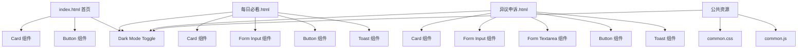

# Flowbite 组件库样式重构计划

## 项目概述

将整个项目的样式严格按照 Flowbite 组件库的官方样式进行重构，确保所有组件都使用 Flowbite 官方推荐的类名和结构。

## 当前问题分析

### 1. 版本不一致
| 文件                  | 当前版本       |
|-----------------------|----------------|
| `index.html`          | flowbite@3.1.2 |
| `pages/每日必看.html` | flowbite@2.5.2 |
| `pages/异议申诉.html` | flowbite@2.5.2 |

### 2. 组件使用问题

#### 按钮组件
- 当前使用自定义样式混合 Tailwind 类
- 未遵循 Flowbite Button 组件的标准类名

#### 卡片组件
- 使用普通 div 而非 Flowbite Card 组件
- 缺少标准卡片结构

#### 输入框组件
- 样式不完全符合 Flowbite Form Input 规范
- 缺少标准的状态样式

#### Toast 提示
- 手动实现，未使用 Flowbite Toast 组件
- 缺少动画效果

#### 深色模式切换
- 未使用 Flowbite 官方的 Dark Mode Toggle 组件样式

---

## 重构方案

### 统一版本

所有页面统一使用 **Flowbite 3.1.2** 版本：

```html
<link href="https://cdn.jsdelivr.net/npm/flowbite@3.1.2/dist/flowbite.min.css" rel="stylesheet" />
<script src="https://cdn.jsdelivr.net/npm/flowbite@3.1.2/dist/flowbite.min.js"></script>
```

### 组件重构对照表

| 组件类型   | 当前实现        | Flowbite 官方组件   |
|------------|-----------------|---------------------|
| 主容器     | 自定义 div      | Card 组件           |
| 功能按钮   | 自定义 button   | Button 组件         |
| 返回按钮   | 自定义 a 标签   | Button 组件 (tag=a) |
| 数量输入框 | 自定义 input    | Form Input 组件     |
| 结果文本框 | 自定义 textarea | Form Textarea 组件  |
| 提示消息   | 手动实现        | Toast 组件          |
| 深色模式   | 自定义 SVG      | Dark Mode Toggle    |

---

## 详细实施步骤

### 第一步：统一 Flowbite 版本

修改 `pages/每日必看.html` 和 `pages/异议申诉.html` 的 CDN 链接：

```html
<!-- 修改前 -->
<link href="https://cdn.jsdelivr.net/npm/flowbite@2.5.2/dist/flowbite.min.css" rel="stylesheet" />
<script src="https://cdn.jsdelivr.net/npm/flowbite@2.5.2/dist/flowbite.min.js"></script>

<!-- 修改后 -->
<link href="https://cdn.jsdelivr.net/npm/flowbite@3.1.2/dist/flowbite.min.css" rel="stylesheet" />
<script src="https://cdn.jsdelivr.net/npm/flowbite@3.1.2/dist/flowbite.min.js"></script>
```

### 第二步：重构 index.html

#### 2.1 Card 组件结构

```html
<!-- Flowbite 官方 Card 样式 -->
<div class="w-full max-w-md p-6 bg-white border border-gray-200 rounded-lg shadow-sm dark:bg-gray-800 dark:border-gray-700">
    <!-- Card 内容 -->
</div>
```

#### 2.2 Button 组件

```html
<!-- Flowbite 官方 Button 样式 -->
<!-- 主要按钮 -->
<button type="button" class="text-white bg-blue-700 hover:bg-blue-800 focus:ring-4 focus:outline-none focus:ring-blue-300 font-medium rounded-lg text-sm px-5 py-2.5 text-center inline-flex items-center dark:bg-blue-600 dark:hover:bg-blue-700 dark:focus:ring-blue-800">
    按钮文字
</button>

<!-- 次要/返回按钮 -->
<a href="..." class="inline-flex items-center px-3 py-2 text-sm font-medium text-gray-700 bg-white border border-gray-200 rounded-lg hover:bg-gray-100 hover:text-blue-700 focus:z-10 focus:ring-4 focus:ring-gray-200 dark:bg-gray-800 dark:text-gray-400 dark:border-gray-600 dark:hover:text-white dark:hover:bg-gray-700">
    <svg class="w-4 h-4 mr-2"><!-- 图标 --></svg>
    返回
</a>
```

#### 2.3 Dark Mode Toggle

```html
<!-- Flowbite 官方深色模式切换按钮 -->
<button id="theme-toggle" type="button" class="text-gray-500 dark:text-gray-400 hover:bg-gray-100 dark:hover:bg-gray-700 focus:outline-none focus:ring-4 focus:ring-gray-200 dark:focus:ring-gray-700 rounded-lg text-sm p-2.5">
    <svg id="theme-toggle-dark-icon" class="hidden w-5 h-5" fill="currentColor" viewBox="0 0 20 20">
        <path d="M17.293 13.293A8 8 0 016.707 2.707a8.001 8.001 0 1010.586 10.586z"></path>
    </svg>
    <svg id="theme-toggle-light-icon" class="hidden w-5 h-5" fill="currentColor" viewBox="0 0 20 20">
        <path d="M10 2a1 1 0 011 1v1a1 1 0 11-2 0V3a1 1 0 011-1zm4 8a4 4 0 11-8 0 4 4 0 018 0zm-.464 4.95l.707.707a1 1 0 001.414-1.414l-.707-.707a1 1 0 00-1.414 1.414zm2.12-10.607a1 1 0 010 1.414l-.706.707a1 1 0 11-1.414-1.414l.707-.707a1 1 0 011.414 0zM17 11a1 1 0 100-2h-1a1 1 0 100 2h1zm-7 4a1 1 0 011 1v1a1 1 0 11-2 0v-1a1 1 0 011-1zM5.05 6.464A1 1 0 106.465 5.05l-.708-.707a1 1 0 00-1.414 1.414l.707.707zm1.414 8.486l-.707.707a1 1 0 01-1.414-1.414l.707-.707a1 1 0 011.414 1.414zM4 11a1 1 0 100-2H3a1 1 0 000 2h1z"></path>
    </svg>
</button>
```

### 第三步：重构 pages/每日必看.html

#### 3.1 Form Input 组件

```html
<!-- Flowbite 官方 Input 样式 -->
<div class="flex items-center justify-between py-2">
    <label class="block mb-2 text-sm font-medium text-gray-900 dark:text-white">标签</label>
    <input type="number" class="bg-gray-50 border border-gray-300 text-gray-900 text-sm rounded-lg focus:ring-blue-500 focus:border-blue-500 block w-24 p-2.5 dark:bg-gray-700 dark:border-gray-600 dark:placeholder-gray-400 dark:text-white dark:focus:ring-blue-500 dark:focus:border-blue-500" placeholder="数量" min="0">
</div>
```

#### 3.2 Toast 组件

```html
<!-- Flowbite 官方 Toast 样式 -->
<div id="toast-success" class="fixed flex items-center w-full max-w-xs p-4 text-gray-500 bg-white rounded-lg shadow-sm dark:text-gray-400 dark:bg-gray-800 right-5 bottom-5" role="alert">
    <div class="inline-flex items-center justify-center flex-shrink-0 w-8 h-8 text-green-500 bg-green-100 rounded-lg dark:bg-green-800 dark:text-green-200">
        <svg class="w-5 h-5" aria-hidden="true" xmlns="http://www.w3.org/2000/svg" fill="currentColor" viewBox="0 0 20 20">
            <path d="M10 .5a9.5 9.5 0 1 0 9.5 9.5A9.51 9.51 0 0 0 10 .5Zm3.707 8.207-4 4a1 1 0 0 1-1.414 0l-2-2a1 1 0 0 1 1.414-1.414L9 10.586l3.293-3.293a1 1 0 0 1 1.414 1.414Z"/>
        </svg>
        <span class="sr-only">Check icon</span>
    </div>
    <div class="ms-3 text-sm font-normal" id="toast-message">操作成功</div>
    <button type="button" class="ms-auto -mx-1.5 -my-1.5 bg-white text-gray-400 hover:text-gray-900 rounded-lg focus:ring-2 focus:ring-gray-300 p-1.5 hover:bg-gray-100 inline-flex items-center justify-center h-8 w-8 dark:text-gray-500 dark:hover:text-white dark:bg-gray-800 dark:hover:bg-gray-700" data-dismiss-target="#toast-success" aria-label="Close">
        <span class="sr-only">Close</span>
        <svg class="w-3 h-3" aria-hidden="true" xmlns="http://www.w3.org/2000/svg" fill="none" viewBox="0 0 14 14">
            <path stroke="currentColor" stroke-linecap="round" stroke-linejoin="round" stroke-width="2" d="m1 1 6 6m0 0 6 6M7 7l6-6M7 7l-6 6"/>
        </svg>
    </button>
</div>
```

#### 3.3 Form Textarea 组件

```html
<!-- Flowbite 官方 Textarea 样式 -->
<div id="resultBox" class="mt-4">
    <label for="resultText" class="block mb-2 text-sm font-medium text-gray-900 dark:text-white">生成结果</label>
    <textarea id="resultText" rows="4" class="block p-2.5 w-full text-sm text-gray-900 bg-gray-50 rounded-lg border border-gray-300 focus:ring-blue-500 focus:border-blue-500 dark:bg-gray-700 dark:border-gray-600 dark:placeholder-gray-400 dark:text-white dark:focus:ring-blue-500 dark:focus:border-blue-500" readonly></textarea>
</div>
```

### 第四步：重构 pages/异议申诉.html

与第三步类似的组件重构，确保样式一致性。

### 第五步：创建公共资源文件

#### 5.1 公共样式文件 `assets/css/common.css`

```css
/* 公共样式 */
body {
    @apply bg-gray-50 dark:bg-gray-900;
}

/* 其他公共样式 */
```

#### 5.2 公共脚本文件 `assets/js/common.js`

```javascript
// 深色模式切换逻辑
// Toast 显示逻辑
// 公共工具函数
```

---

## 组件架构图



---

## 重构后的文件结构

```
webtool-work/
├── index.html                    # 首页 - 重构后
├── pages/
│   ├── 每日必看.html             # 每日必看页面 - 重构后
│   └── 异议申诉.html             # 异议申诉页面 - 重构后
├── assets/
│   ├── css/
│   │   └── common.css           # 公共样式
│   └── js/
│       └── common.js            # 公共脚本
└── 404.html                     # 404页面
```

---

## 验证清单

- [ ] 所有页面 Flowbite 版本统一为 3.1.2
- [ ] 所有按钮使用 Flowbite Button 组件样式
- [ ] 所有卡片使用 Flowbite Card 组件样式
- [ ] 所有输入框使用 Flowbite Form Input 组件样式
- [ ] 所有 Toast 使用 Flowbite Toast 组件样式
- [ ] 深色模式在所有页面正常工作
- [ ] 所有页面视觉风格一致
- [ ] 响应式布局正常工作

---

## 注意事项

1. **保持功能不变**：重构仅涉及样式，不改变任何业务逻辑
2. **渐进式重构**：按页面逐一重构，确保每个页面独立可用
3. **测试深色模式**：每个页面重构后都要测试深色模式切换
4. **保留 emoji 图标**：按钮中的 emoji 图标保持不变
